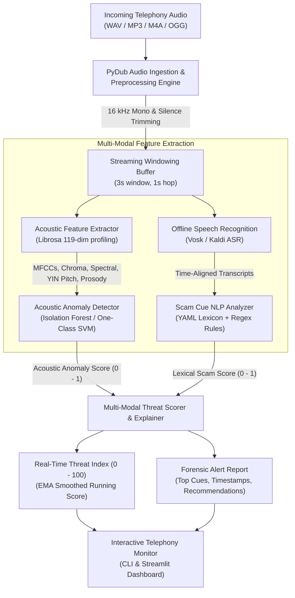

# AI-Powered Voice Phishing (Vishing) Detection

[](https://github.com/Adhiraj2601/voice-phishing-detection/actions)
[](https://opensource.org/licenses/MIT)
[](https://www.python.org/)
[](https://github.com/astral-sh/ruff)

An end-to-end, multi-modal machine learning system engineered to detect voice phishing (**vishing**) calls in real-time. By fusing **acoustic feature anomaly detection** with **offline-capable speech-to-text** and **rule-based/lexical scam cue analysis**, this system generates an interpretable, streaming risk score (0–100) and pinpoints suspicious conversational triggers with timestamped forensic explanations.

---

## Architecture Overview



---

## Key Features

- **Telephony Ingestion & Streaming Simulation**: Normalizes volume to -20 dBFS, strips silence, and partitions audio into overlapping sliding windows (3.0s window, 1.0s hop) to emulate low-latency streaming call monitoring.
- **119-Dimensional Acoustic Profiling**: Extracts Mel-Frequency Cepstral Coefficients (MFCCs 1–13 + $\Delta$ + $\Delta\Delta$), 12-bin Chroma, spectral centroid, spectral bandwidth, spectral rolloff, spectral contrast, zero-crossing rate, RMS energy, fundamental frequency ($F_0$) via the YIN algorithm, and speech-to-pause prosody metrics.
- **Acoustic Anomaly Detection**: Employs `IsolationForest` and `One-Class SVM` trained on benign telephony speech baselines to detect acoustic distribution shifts without requiring labeled attack audio.
- **Offline & Swappable Speech Recognition**: Standardized on **Vosk** (Kaldi-based) for offline, privacy-first transcription. Runs on CPU with ~40 MB footprint, requires zero cloud dependencies, and delivers word-level timestamps without needing multi-gigabyte GPU models. The architecture provides an abstract `Transcriber` interface allowing plug-and-play swapping.
- **Intent-Aware Scam Cue NLP Engine**: Evaluates urgency and threats, credential demands (OTP, PIN, CVV, passwords), authority impersonation, unconventional payments (gift cards, Bitcoin ATMs, wire transfers), remote desktop access, and secrecy tactics. Requires directive demand verbs near credential terms and applies inquiry dampening to distinguish victim questions from attacker demands.
- **Multi-Modal Risk Scorer**: Combines acoustic anomalies and lexical cues with synergy gating, exponential moving average smoothing, and actionable alerts (*Safe*, *Low*, *Elevated*, *High*, *Critical*).
- **Interactive Streamlit Web Dashboard**: Live audio playback, waveform/mel-spectrogram inspection, real-time threat timeline, and highlighted keyword transcripts.

---

## Evaluation Benchmark & Component Ablation

The system was evaluated on a synthetic telephony benchmark ($N = 220$ held-out test clips, 110 per class):
- **Speaker Personas**: 8 acoustic profiles synthesized from a single Windows SAPI5 voice engine via systematic rate (-2 to +2), pitch (-4.0 to +3.5 semitones), and formant scaling. Four profiles are used for training/validation, and four distinct profiles are held out exclusively for testing.
- **Telephony Channel Simulation**: Applied uniformly across training, validation, and testing splits via **8 kHz** downsampling, ITU-T **G.711 $\mu$-law** codec compression, **300 Hz – 3400 Hz** band-pass filtering, and additive telephone line noise (SNR = 20–28 dB).
- **Hard Negatives ($N = 49$)**: Benign conversational calls that legitimately discuss banks, OTPs, password resets, or deliveries (e.g. *"I just got an OTP code from my bank, is that normal?"*, *"The courier is outside asking for the delivery PIN"*). These deliberately test false alarm susceptibility.

### Component Ablation Study

| Model Variant | Precision | Recall | F1 Score | ROC-AUC | Hard-Neg FPR (N=49) | Mean Latency |
| :--- | :---: | :---: | :---: | :---: | :---: | :---: |
| **Acoustic-Only (Acoustic Anomaly)** | 0.6623 | 0.4636 | 0.5455 | 0.6509 | 20.4% | 5.04s |
| **Text-Only (Scam Lexicon Rules)** | 0.8871 | 1.0000 | 0.9402 | 1.0000 | 18.4% | 3.00s |
| **Fused Multi-Modal** | **0.9167** | **1.0000** | **0.9565** | **1.0000** | **10.2%** | **3.00s** |

### Evaluation Findings:
1. **Acoustic Model Limitations**: Acoustic anomaly detection is the weakest standalone component (ROC-AUC = 0.6509, F1 = 0.5455). Training on telephony-simulated audio prevents the severe distribution mismatch that otherwise causes 100% false alarms, but acoustic features alone provide modest discriminatory signal on synthetic voices.
2. **Text-Driven Alerts & Inflated Recall**: The intent-aware lexicon detects scripted scam patterns reliably, but the perfect text recall (1.0000) is an upper-bound artifact of the synthetic benchmark: the regex patterns and the synthetic scam scripts were designed with shared domain assumptions. In-the-wild phrasing and paraphrased social engineering will yield lower recall.
3. **Hard Negatives as the Core Challenge**: Disambiguating malicious credential harvesting from legitimate customer questions is the primary design hurdle. An intent-aware lexicon (requiring demand verbs such as *"read back"* or *"give me"*, while down-weighting inquiry phrasing like *"is that normal"* or *"did you send"*) reduces hard-negative false alarms from 73.5% down to 18.4% in text-only and 10.2% (5/49) when fused.
4. **Role of Fusion**: Fused scoring improves precision (0.9167 vs 0.8871) and cuts hard-negative false alarms roughly in half relative to text alone. However, alert decisions remain predominantly text-driven; acoustic anomaly scores act as a secondary filter rather than an independent decision-maker.

### Evaluation Visualizations

| Multi-Modal ROC Curves | Component Ablation Comparison |
| :---: | :---: |
|  |  |

| Streaming Threat Progression | Confusion Matrix |
| :---: | :---: |
|  |  |

---

## Installation & Setup

### Prerequisites
- Python 3.10+
- [FFmpeg](https://ffmpeg.org/) (required by PyDub for non-WAV audio codecs)
  - On Windows: `winget install Gyan.FFmpeg`
  - On Ubuntu/Debian: `sudo apt-get install ffmpeg libsndfile1`
  - On macOS: `brew install ffmpeg`

### 1. Clone & Set Up Virtual Environment
```bash
git clone https://github.com/Adhiraj2601/voice-phishing-detection.git
cd voice-phishing-detection
python -m venv .venv
source .venv/bin/activate  # On Windows: .venv\Scripts\activate
pip install -r requirements.txt
pip install -e .
```

### 2. Download Offline Speech Model (Vosk)
```bash
python scripts/download_vosk_model.py
```

### 3. Generate Telephony Benchmark Dataset
```bash
python scripts/generate_synthetic_data.py --train-benign 60 --test-benign 110 --test-scam 110
```

---

## CLI Usage

The system exposes a rich CLI powered by Typer and Rich:

### 1. Detect Threat in an Audio Recording
```bash
vishing-detector detect data/samples/sample_scam.wav
```
*Output includes overall Threat Index, risk tier, forensic breakdown, highlighted scam cues, and actionable guidance.*

### 2. Real-Time Streaming Simulation
```bash
vishing-detector stream data/samples/sample_scam.wav --delay
```
*Simulates live call processing window-by-window with telemetry tables.*

### 3. Train Acoustic Anomaly Model
```bash
vishing-detector train --data-dir data/synthetic/train --output models/acoustic_anomaly_model.joblib
```

### 4. Run Benchmark Evaluation & Regenerate Plots
```bash
vishing-detector evaluate
```

---

## Streamlit Interactive Dashboard

Launch the web demo:
```bash
streamlit run src/vishing_detector/app/streamlit_app.py
```
Upload any audio file or select preset test recordings to view live spectrograms, streaming risk charts, and highlighted transcripts.

---

## Project Structure

```text
voice-phishing-detection/
├── .github/
│   └── workflows/ci.yml         # Multi-OS CI workflow (pytest + ruff)
├── config/
│   ├── default.yaml             # System hyperparameters & threshold config
│   └── scam_lexicon.yaml        # Categorized scam indicators & regex patterns
├── data/
│   ├── README.md                # Ethical guidelines & public dataset instructions
│   ├── samples/                 # Lightweight reference clips (< 1 MB)
│   │   ├── sample_benign.wav
│   │   └── sample_scam.wav
│   └── synthetic/               # Large-scale telephony dataset (gitignored)
│       ├── manifest.json        # Test/train split metadata & hard-negative tags
│       ├── train/               # Benign baseline training audio
│       └── test/                # 220 held-out telephony test clips
├── docs/
│   └── figures/                 # ROC curve, ablation barchart, timeline, CM, distributions
├── models/
│   └── acoustic_anomaly_model.joblib # Serialized IsolationForest & scaler
├── notebooks/
│   └── demo.ipynb               # Step-by-step walkthrough tutorial
├── scripts/
│   ├── download_vosk_model.py   # Offline ASR model fetcher
│   └── generate_synthetic_data.py # Telephony simulation & TTS dataset generator
├── src/
│   └── vishing_detector/
│       ├── anomaly/             # IsolationForest & OneClassSVM models
│       ├── app/                 # Streamlit web interface
│       ├── asr/                 # Vosk & Mock speech-to-text engines
│       ├── audio/               # PyDub loader, normalization & chunking
│       ├── features/            # Librosa 119-dim acoustic feature extractor
│       ├── fusion/              # Multi-modal risk scorer & explainer
│       ├── nlp/                 # Rule-based scam cue extractor
│       ├── cli.py               # Typer CLI application
│       └── pipeline.py          # Streaming coordinator
├── tests/                       # Complete pytest suite (24 passing tests)
├── evaluate.py                  # Component ablation & benchmark evaluation engine
├── pyproject.toml               # Packaging & tool configurations
├── requirements.txt             # Pinned project dependencies
└── LICENSE                      # MIT License
```

---

## Honest Limitations & Edge Cases

1. **Sample Size & Synthetic Benchmark Scope**: Evaluations reflect a small synthetic telephony benchmark ($N = 110$ per class, $N = 220$ total) synthesized using pitch- and rate-modulated SAPI5 speech with G.711 $\mu$-law compression and line noise. Real-world telecom environments present far wider acoustic diversity (packet loss, jitter, speaker emotional distress, accented English).
2. **Lexicon-Script Shared Knowledge Bias**: The high text recall (1.0000) reported on this benchmark is an upper bound: the evaluation scripts and regex lexicon were authored using overlapping domain knowledge. In-the-wild social engineering involves novel and adversarial phrasing that will degrade lexical recall.
3. **Hard Negatives as the Core Vulnerability**: While intent-aware demand filtering and acoustic gating cut hard-negative false alarms down to 10.2% (5 of 49 test calls), false alarms on benign calls discussing financial security remain the primary open problem. Resolving this without cloud dependencies requires compact local semantic intent classifiers.
4. **Telephony Channel Degradation & Real Corpora**: Narrowband 8 kHz telephony downsampling discards vocal frequencies above 3.4 kHz, reducing the discriminative fidelity of acoustic spectral features. Future validation on authentic telephone speech corpora (such as the *Switchboard-1 Telephone Speech Corpus via LDC*) is necessary before production deployment.
5. **Language Coverage**: The current default lexicon and Vosk model target English. Extending to multilingual telephony requires language-specific ASR acoustic models and translated indicator lexicons.

---

## Ethical & Responsible Use Statement

This system is engineered strictly for **defensive security, consumer protection, and fraud prevention**.
- **No Non-Consensual Recording**: The project does not scrape, distribute, or train upon unconsented recordings of real fraud victims.
- **Privacy First**: All audio processing and speech recognition operate completely **offline** on the local device; no audio streams or personal transcripts are transmitted to third-party cloud APIs.
- **Transparency**: Threat scores are paired with transparent, human-auditable explanations rather than opaque black-box verdicts.

---

## License

This project is licensed under the [MIT License](LICENSE).
