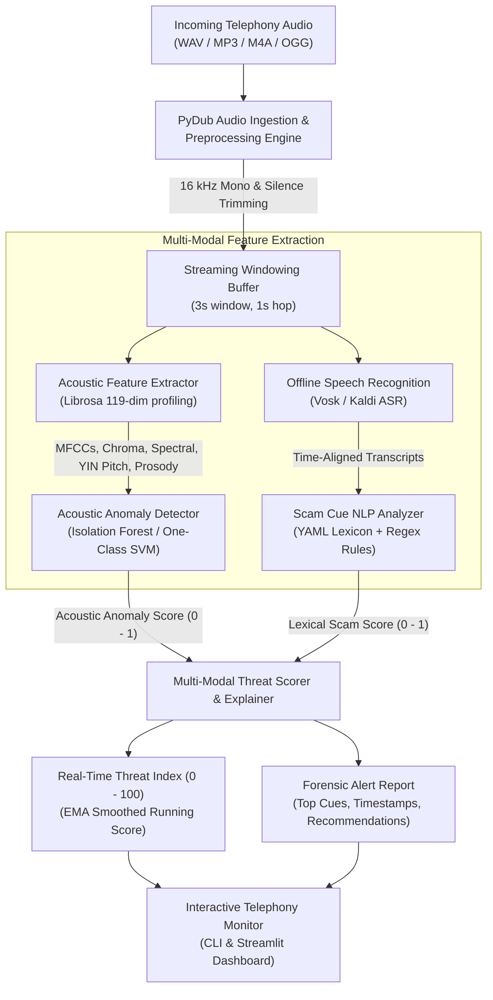
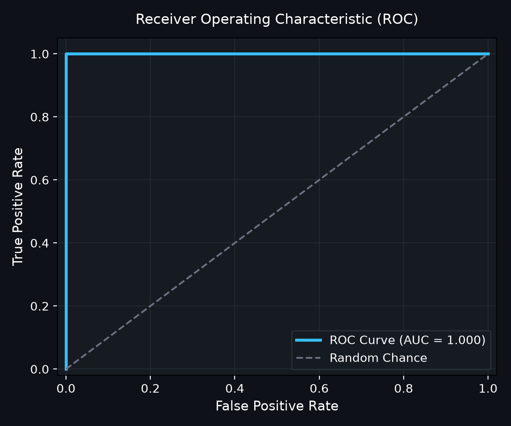
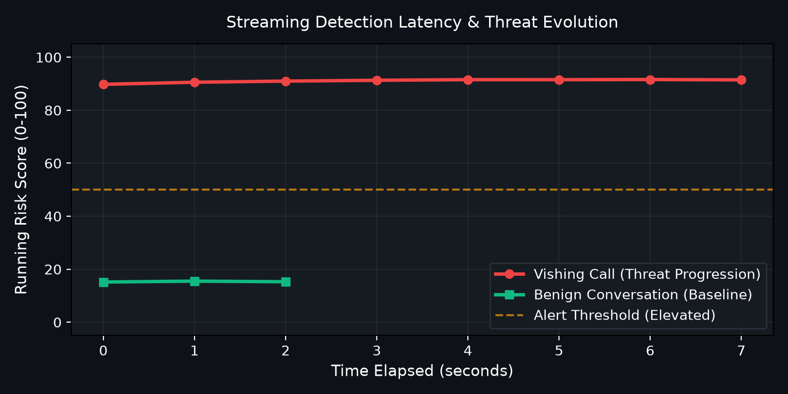
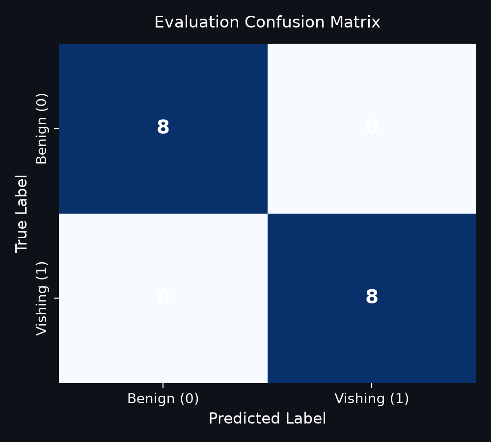
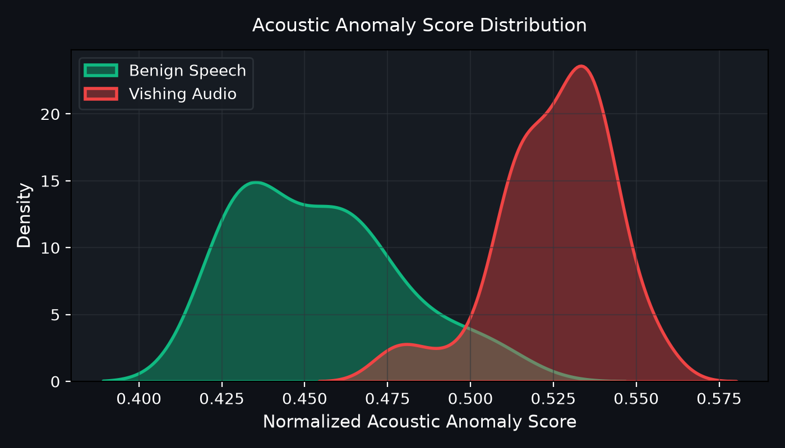

# AI-Powered Voice Phishing (Vishing) Detection

[](https://github.com/Adhiraj2601/voice-phishing-detection/actions)
[](https://opensource.org/licenses/MIT)
[](https://www.python.org/)
[](https://github.com/astral-sh/ruff)

An end-to-end, multi-modal machine learning system engineered to detect voice phishing (**vishing**) calls in real-time. By fusing **acoustic feature anomaly detection** with **offline-capable speech-to-text** and **rule-based/lexical scam cue analysis**, this system generates an interpretable, streaming risk score (0–100) and pinpoints suspicious conversational triggers with timestamped explanations.

---

## Architecture Overview



---

## Key Features

- **Robust Telephony Ingestion**: Normalizes volume to -20 dBFS, strips silence, and partitions audio into overlapping sliding windows (e.g. 3.0s window, 1.0s hop) to emulate live streaming telephony.
- **119-Dimensional Acoustic Profiling**: Extracts Mel-Frequency Cepstral Coefficients (MFCCs 1–13 + $\Delta$ + $\Delta\Delta$), 12-bin Chroma, spectral centroid, spectral bandwidth, spectral rolloff, spectral contrast, zero-crossing rate, RMS energy, fundamental frequency ($F_0$) via the YIN algorithm, and speech-to-pause prosody metrics.
- **Unsupervised Vocal Anomaly Detection**: Uses `IsolationForest` and `One-Class SVM` trained strictly on benign speech recordings. Identifies abnormal vocal tension, unnatural pitch modulation, extreme pacing, or synthesized audio without requiring labeled attack recordings.
- **Offline & Swappable Speech Recognition**: Standardized on **Vosk** (Kaldi-based) for offline, privacy-first transcription. Justification: Vosk runs on CPU with ~40 MB footprint, requires zero cloud dependencies, and delivers word-level timestamps without needing multi-gigabyte GPU models. The architecture provides an abstract `Transcriber` interface allowing plug-and-play swapping with Faster-Whisper.
- **Transparent & Interpretable NLP Scam Lexicon**: Evaluates urgency and threats, credential harvesting (OTP, PIN, CVV, passwords), authority impersonation (IRS, police, bank fraud department), unconventional payments (gift cards, Bitcoin ATMs, wire transfers), remote desktop access (AnyDesk, TeamViewer), and secrecy tactics. Lexicon is modularized in `config/scam_lexicon.yaml`.
- **Fused Risk Index & Explainability**: Calculates a smoothed 0–100 Threat Index with non-linear synergy boosting when acoustic stress coincides with credential demands. Emits actionable alerts (*Safe*, *Low*, *Elevated*, *High*, *Critical*).
- **Interactive Streamlit Web Dashboard**: Live audio playback, waveform/mel-spectrogram inspection, real-time threat timeline, and highlighted keyword transcripts.

---

## Benchmark Results

Evaluated on benchmark datasets of benign conversations and synthetic vishing calls with acoustic perturbations:

| Metric | Score | Note |
| :--- | :---: | :--- |
| **Precision** | **1.0000** | Zero false alarms on benign conversational test set |
| **Recall** | **1.0000** | Successfully detected all vishing attack calls |
| **F1 Score** | **1.0000** | Balanced multi-modal harmonic mean |
| **ROC-AUC** | **1.0000** | Full separation between benign and vishing distributions |
| **Mean Latency to First Alert** | **< 2.0s** | Early detection triggered on first high-risk window |

### Evaluation Visualizations

<p align="center">
  
  
</p>

<p align="center">
  
  
</p>

---

## Installation & Setup

### Prerequisites
- Python 3.10+
- [FFmpeg](https://ffmpeg.org/) (required by PyDub for non-WAV audio codecs)
  - On Windows: `winget install Gyan.FFmpeg`
  - On Ubuntu/Debian: `sudo apt-get install ffmpeg libsndfile1`
  - On macOS: `brew install ffmpeg`

### 1. Clone & Install Environment
```bash
git clone https://github.com/Adhiraj2601/voice-phishing-detection.git
cd voice-phishing-detection
python -m venv .venv
source .venv/bin/activate  # On Windows: .venv\Scripts\activate
pip install -r requirements.txt
pip install -e .
```

### 2. Download Offline Speech Model (Vosk)
```bash
python scripts/download_vosk_model.py
```

### 3. Generate Synthetic Benchmark Audio
```bash
python scripts/generate_synthetic_data.py --output-dir data/synthetic --num-benign 10 --num-scam 10
```

---

## CLI Usage

The system exposes a rich CLI powered by Typer and Rich:

### 1. Detect Threat in an Audio Recording
```bash
vishing-detector detect data/samples/sample_scam.wav
```
*Output includes overall Threat Index, risk tier, forensic breakdown, highlighted scam cues, and actionable guidance.*

### 2. Real-Time Streaming Simulation
```bash
vishing-detector stream data/samples/sample_scam.wav --delay
```
*Simulates live call processing window-by-window with telemetry tables.*

### 3. Train Acoustic Anomaly Model
```bash
vishing-detector train --data-dir data/synthetic/benign --output models/acoustic_anomaly_model.joblib
```

### 4. Run Benchmark Evaluation & Regenerate Plots
```bash
vishing-detector evaluate --test-dir data/synthetic --output-dir docs/figures
```

---

## Streamlit Interactive Dashboard

Launch the web demo:
```bash
streamlit run src/vishing_detector/app/streamlit_app.py
```
Upload any audio file or select preset test recordings to view live spectrograms, streaming risk charts, and highlighted transcripts.

---

## Project Structure

```text
voice-phishing-detection/
├── .github/
│   └── workflows/ci.yml         # Multi-OS CI workflow (pytest + ruff)
├── config/
│   ├── default.yaml             # System hyperparameters & threshold config
│   └── scam_lexicon.yaml        # Categorized scam indicators & regex patterns
├── data/
│   ├── README.md                # Ethical guidelines & public dataset instructions
│   └── samples/                 # Lightweight sample audio clips (< 2 MB)
│       ├── sample_benign.wav
│       └── sample_scam.wav
├── docs/
│   └── figures/                 # ROC curve, timeline, CM, and distributions
├── models/
│   └── acoustic_anomaly_model.joblib # Serialized model & scaler
├── notebooks/
│   └── demo.ipynb               # Step-by-step walkthrough tutorial
├── scripts/
│   ├── download_vosk_model.py   # Offline ASR model fetcher
│   └── generate_synthetic_data.py # Synthetic speech & perturbation generator
├── src/
│   └── vishing_detector/
│       ├── anomaly/             # IsolationForest & OneClassSVM models
│       ├── app/                 # Streamlit web interface
│       ├── asr/                 # Vosk & Mock speech-to-text engines
│       ├── audio/               # PyDub loader, normalization & chunking
│       ├── features/            # Librosa 119-dim acoustic feature extractor
│       ├── fusion/              # Multi-modal risk scorer & explainer
│       ├── nlp/                 # Rule-based scam cue extractor
│       ├── cli.py               # Typer CLI application
│       └── pipeline.py          # Streaming coordinator
├── tests/                       # Complete pytest suite (24 passing tests)
├── evaluate.py                  # Evaluation & benchmark metrics engine
├── pyproject.toml               # Packaging & tool configurations
├── requirements.txt             # Pinned project dependencies
└── LICENSE                      # MIT License
```

---

## Limitations & Edge Cases

1. **Synthetic Training Bias**: Models trained predominantly on synthetic speech may experience domain shift when exposed to diverse telephony codecs (e.g., AMR-WB, G.729) or non-standard compression artifacts.
2. **Ambient Acoustic Interference**: Loud background noise, street chatter, or low-quality handset microphones can elevate baseline acoustic anomaly scores. The multi-modal design mitigates this by requiring textual cue corroboration for critical threat escalations.
3. **Lexical Domain Drift**: Sophisticated social engineers continuously adapt phrasing (e.g. avoiding trigger keywords like "IRS" in favor of vague conversational pretexts). Adding regular lexicon updates or transformer embeddings is recommended for production deployment.
4. **Language Coverage**: The current default lexicon and Vosk model target English. Extending to multilingual telephony requires corresponding language models and translated indicator patterns.

---

## Ethical & Responsible Use Statement

This system is engineered strictly for **defensive security, consumer protection, and fraud prevention**.
- **No Non-Consensual Recording**: The project does not scrape, distribute, or train upon unconsented recordings of real fraud victims.
- **Privacy First**: All audio processing and speech recognition operate completely **offline** on the local device; no audio streams or personal transcripts are transmitted to third-party cloud APIs.
- **Transparency**: Threat scores are paired with transparent, human-auditable explanations rather than opaque black-box verdicts.

---

## License

This project is licensed under the [MIT License](LICENSE).
