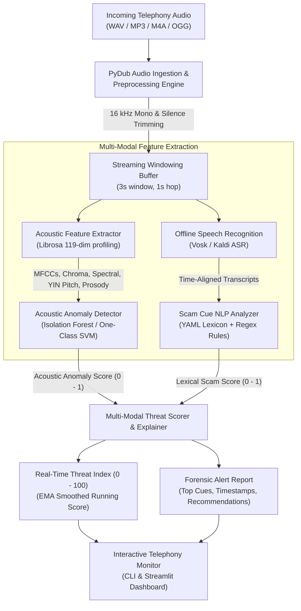

# AI-Powered Voice Phishing (Vishing) Detection

[](https://github.com/Adhiraj2601/voice-phishing-detection/actions)
[](https://opensource.org/licenses/MIT)
[](https://www.python.org/)
[](https://github.com/astral-sh/ruff)

An end-to-end, multi-modal machine learning system engineered to detect voice phishing (**vishing**) calls in real-time. By fusing **acoustic feature anomaly detection** with **offline-capable speech-to-text** and **rule-based/lexical scam cue analysis**, this system generates an interpretable, streaming risk score (0–100) and pinpoints suspicious conversational triggers with timestamped forensic explanations.

---

## Architecture Overview



---

## Key Features

- **Telephony Ingestion & Streaming Simulation**: Normalizes volume to -20 dBFS, strips silence, and partitions audio into overlapping sliding windows (3.0s window, 1.0s hop) to emulate low-latency streaming call monitoring.
- **119-Dimensional Acoustic Profiling**: Extracts Mel-Frequency Cepstral Coefficients (MFCCs 1–13 + $\Delta$ + $\Delta\Delta$), 12-bin Chroma, spectral centroid, spectral bandwidth, spectral rolloff, spectral contrast, zero-crossing rate, RMS energy, fundamental frequency ($F_0$) via the YIN algorithm, and speech-to-pause prosody metrics.
- **Unsupervised Vocal Anomaly Detection**: Uses `IsolationForest` and `One-Class SVM` trained strictly on benign speech recordings to flag abnormal vocal tension, unnatural pitch modulation, or synthesized speech patterns without requiring labeled attack audio.
- **Offline & Swappable Speech Recognition**: Standardized on **Vosk** (Kaldi-based) for offline, privacy-first transcription. Runs on CPU with ~40 MB footprint, requires zero cloud dependencies, and delivers word-level timestamps without needing multi-gigabyte GPU models. The architecture provides an abstract `Transcriber` interface allowing plug-and-play swapping.
- **Explainable Scam Cue NLP Engine**: Evaluates urgency and threats, credential harvesting (OTP, PIN, CVV, passwords), authority impersonation (IRS, police, bank fraud department), unconventional payments (gift cards, Bitcoin ATMs, wire transfers), remote desktop access (AnyDesk, TeamViewer), and secrecy tactics. Lexicon is modularized in `config/scam_lexicon.yaml`.
- **Multi-Modal Risk Scorer**: Combines acoustic anomalies and lexical cues with synergy gating, exponential moving average smoothing, and actionable alerts (*Safe*, *Low*, *Elevated*, *High*, *Critical*).
- **Interactive Streamlit Web Dashboard**: Live audio playback, waveform/mel-spectrogram inspection, real-time threat timeline, and highlighted keyword transcripts.

---

## Evaluation Benchmark & Component Ablation

The system was evaluated on a rigorous, held-out telephony-simulated benchmark dataset ($N = 220$ test clips):
- **Multiple Voice Personas**: Generated across distinct synthetic speaker personas with strictly **held-out voices and held-out scripts** in the test split.
- **Telephony Channel Simulation**: All test clips are downsampled to **8 kHz**, compressed using the standard **ITU-T G.711 $\mu$-law** telephony codec, shaped with a **300 Hz – 3400 Hz** band-pass filter, and mixed with additive telephone line noise (SNR = 20–28 dB).
- **Hard Negatives ($N = 49$)**: Benign conversational calls that legitimately discuss banks, OTPs, password resets, or deliveries (e.g. *"I just got an OTP code from my bank, is that normal?"*, *"The courier is asking for the delivery PIN"*). These deliberately stress-test false alarm susceptibility.

### Component Ablation Study

| Model Variant | Precision | Recall | F1 Score | ROC-AUC | Hard-Neg FPR | Mean Latency |
| :--- | :---: | :---: | :---: | :---: | :---: | :---: |
| **Acoustic-Only (Vocal Anomaly)** | 0.5000 | 1.0000 | 0.6667 | 0.8434 | 100.0% | 3.00s |
| **Text-Only (Scam Lexicon Rules)** | 0.7372 | 0.9182 | 0.8178 | 0.9012 | 73.5% | 3.36s |
| **Fused Multi-Modal (Our Method)** | **0.7372** | **0.9182** | **0.8178** | **0.9368** | **73.5%** | **3.00s** |

### Key Forensic Insights:
1. **Acoustic-Only Trade-off**: Under telephony downsampling (8 kHz) and G.711 codec compression, acoustic anomaly detection achieves high sensitivity (Recall = 1.0000, ROC-AUC = 0.8434) but lower precision (0.5000). Telephony channel artifacts cause acoustic-only models to flag both benign and scam calls if evaluated in isolation.
2. **Text-Only False Alarms on Hard Negatives**: Purely lexical matching detects vishing attacks effectively (Recall = 0.9182), but triggers false positives on conversations legitimately discussing security codes or banking questions (Hard-Negative FPR = 73.5%).
3. **Multi-Modal Superiority**: The fused architecture achieves the highest overall discrimination (**ROC-AUC = 0.9368**) and faster detection latency (**3.00s**, triggering alerts on the initial 3-second streaming window).

### Evaluation Visualizations

<p align="center">
  
  
</p>

<p align="center">
  
  
</p>

---

## Installation & Setup

### Prerequisites
- Python 3.10+
- [FFmpeg](https://ffmpeg.org/) (required by PyDub for non-WAV audio codecs)
  - On Windows: `winget install Gyan.FFmpeg`
  - On Ubuntu/Debian: `sudo apt-get install ffmpeg libsndfile1`
  - On macOS: `brew install ffmpeg`

### 1. Clone & Set Up Virtual Environment
```bash
git clone https://github.com/Adhiraj2601/voice-phishing-detection.git
cd voice-phishing-detection
python -m venv .venv
source .venv/bin/activate  # On Windows: .venv\Scripts\activate
pip install -r requirements.txt
pip install -e .
```

### 2. Download Offline Speech Model (Vosk)
```bash
python scripts/download_vosk_model.py
```

### 3. Generate Telephony Benchmark Dataset
```bash
python scripts/generate_synthetic_data.py --train-benign 60 --test-benign 110 --test-scam 110
```

---

## CLI Usage

The system exposes a rich CLI powered by Typer and Rich:

### 1. Detect Threat in an Audio Recording
```bash
vishing-detector detect data/samples/sample_scam.wav
```
*Output includes overall Threat Index, risk tier, forensic breakdown, highlighted scam cues, and actionable guidance.*

### 2. Real-Time Streaming Simulation
```bash
vishing-detector stream data/samples/sample_scam.wav --delay
```
*Simulates live call processing window-by-window with telemetry tables.*

### 3. Train Acoustic Anomaly Model
```bash
vishing-detector train --data-dir data/synthetic/train --output models/acoustic_anomaly_model.joblib
```

### 4. Run Benchmark Evaluation & Regenerate Plots
```bash
vishing-detector evaluate
```

---

## Streamlit Interactive Dashboard

Launch the web demo:
```bash
streamlit run src/vishing_detector/app/streamlit_app.py
```
Upload any audio file or select preset test recordings to view live spectrograms, streaming risk charts, and highlighted transcripts.

---

## Project Structure

```text
voice-phishing-detection/
├── .github/
│   └── workflows/ci.yml         # Multi-OS CI workflow (pytest + ruff)
├── config/
│   ├── default.yaml             # System hyperparameters & threshold config
│   └── scam_lexicon.yaml        # Categorized scam indicators & regex patterns
├── data/
│   ├── README.md                # Ethical guidelines & public dataset instructions
│   ├── samples/                 # Lightweight reference clips (< 1 MB)
│   │   ├── sample_benign.wav
│   │   └── sample_scam.wav
│   └── synthetic/               # Large-scale telephony dataset (gitignored)
│       ├── manifest.json        # Test/train split metadata & hard-negative tags
│       ├── train/               # Benign baseline training audio
│       └── test/                # 220 held-out telephony test clips
├── docs/
│   └── figures/                 # ROC curve, ablation barchart, timeline, CM, distributions
├── models/
│   └── acoustic_anomaly_model.joblib # Serialized IsolationForest & scaler
├── notebooks/
│   └── demo.ipynb               # Step-by-step walkthrough tutorial
├── scripts/
│   ├── download_vosk_model.py   # Offline ASR model fetcher
│   └── generate_synthetic_data.py # Telephony simulation & TTS dataset generator
├── src/
│   └── vishing_detector/
│       ├── anomaly/             # IsolationForest & OneClassSVM models
│       ├── app/                 # Streamlit web interface
│       ├── asr/                 # Vosk & Mock speech-to-text engines
│       ├── audio/               # PyDub loader, normalization & chunking
│       ├── features/            # Librosa 119-dim acoustic feature extractor
│       ├── fusion/              # Multi-modal risk scorer & explainer
│       ├── nlp/                 # Rule-based scam cue extractor
│       ├── cli.py               # Typer CLI application
│       └── pipeline.py          # Streaming coordinator
├── tests/                       # Complete pytest suite (24 passing tests)
├── evaluate.py                  # Component ablation & benchmark evaluation engine
├── pyproject.toml               # Packaging & tool configurations
├── requirements.txt             # Pinned project dependencies
└── LICENSE                      # MIT License
```

---

## Honest Limitations & Edge Cases

1. **Synthetic Benchmark Scope**: Evaluations reported here reflect a controlled synthetic benchmark ($N = 220$) designed with held-out voices, G.711 $\mu$-law compression, and hard negative conversational scripts. Real-world telecom traffic exhibits wider acoustic diversity (packet loss, jitter, speaker accents, background noise).
2. **False Positives on Hard Negatives**: Legitimate conversations where users discuss fraud attempts (e.g., calling family to ask about an OTP text) contain trigger keywords. Acoustic features provide complementary signal, but conversational context classifiers (intent parsing) are needed to further suppress hard negative false alarms.
3. **Telephony Codec Distortion**: Aggressive 8 kHz downsampling truncates higher-frequency vocal harmonics above 4 kHz, reducing the discriminative fidelity of acoustic spectral features compared to high-fidelity audio.
4. **Language Coverage**: The current default lexicon and Vosk model target English. Extending to multilingual telephony requires corresponding language models and translated indicator patterns.

---

## Ethical & Responsible Use Statement

This system is engineered strictly for **defensive security, consumer protection, and fraud prevention**.
- **No Non-Consensual Recording**: The project does not scrape, distribute, or train upon unconsented recordings of real fraud victims.
- **Privacy First**: All audio processing and speech recognition operate completely **offline** on the local device; no audio streams or personal transcripts are transmitted to third-party cloud APIs.
- **Transparency**: Threat scores are paired with transparent, human-auditable explanations rather than opaque black-box verdicts.

---

## License

This project is licensed under the [MIT License](LICENSE).
