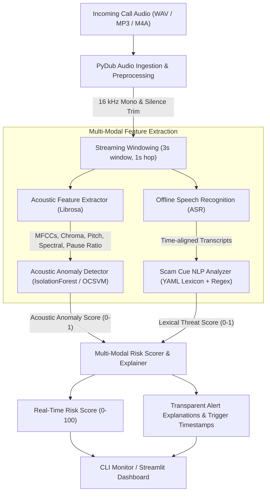

# AI-Powered Voice Phishing (Vishing) Detection

[](https://github.com/Adhiraj2601/voice-phishing-detection/actions)
[](https://opensource.org/licenses/MIT)
[](https://www.python.org/)

An end-to-end, multi-modal machine learning system engineered to detect voice phishing (**vishing**) calls in real-time. By fusing **acoustic feature anomaly detection** with **offline-capable speech-to-text** and **rule-based/lexical scam cue analysis**, this system generates an interpretable, streaming risk score (0–100) and pinpoints suspicious conversational triggers with timestamped explanations.

---

## Architecture Overview



---

## Key Features

- **Robust Audio Ingestion**: Normalizes loudness, strips dead silence, and chunks incoming calls with overlapping rolling windows to simulate low-latency streaming telephony.
- **Rich Acoustic Profiling**: Extracts 40+ acoustic dimensions with Librosa, including MFCCs ($\Delta, \Delta\Delta$), chroma, spectral rolloff/contrast/centroid, zero-crossing rate, RMS energy, fundamental frequency ($F_0$), and speech-to-pause ratios.
- **Unsupervised Anomaly Modeling**: Uses `IsolationForest` and `One-Class SVM` trained exclusively on normal conversations to flag high-stress, rapid, robotic, or unnatural vocal acoustics without requiring labeled attack audio.
- **Explainable Scam Cue Analysis**: Identifies coercion, urgency, credential harvesting (OTP/PIN/CVV/SSN), authority impersonation (IRS/police/bank), financial demands (crypto/gift cards), remote desktop requests, and secrecy tactics.
- **Streaming Threat Scoring**: Computes a continuous, smoothed Threat Index (0–100) with configurable alerts: *Low*, *Elevated*, and *Critical*.
- **Interactive Visualizations**: Includes a full Streamlit dashboard with real-time waveform inspection, risk progression graphs, and highlighted transcripts.

---

## Quickstart & Installation

### Prerequisites
- Python 3.10 or higher
- [FFmpeg](https://ffmpeg.org/) (for PyDub audio decoding)

### 1. Clone & Set Up Virtual Environment
```bash
git clone https://github.com/Adhiraj2601/voice-phishing-detection.git
cd voice-phishing-detection
python -m venv .venv
source .venv/bin/activate  # On Windows: .venv\Scripts\activate
pip install -r requirements.txt
```

### 2. Run Tests
```bash
pytest -v
```

### 3. Launch Demo UI
```bash
streamlit run src/vishing_detector/app/streamlit_app.py
```
