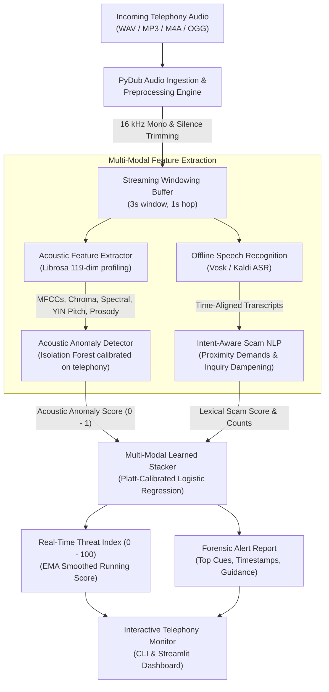
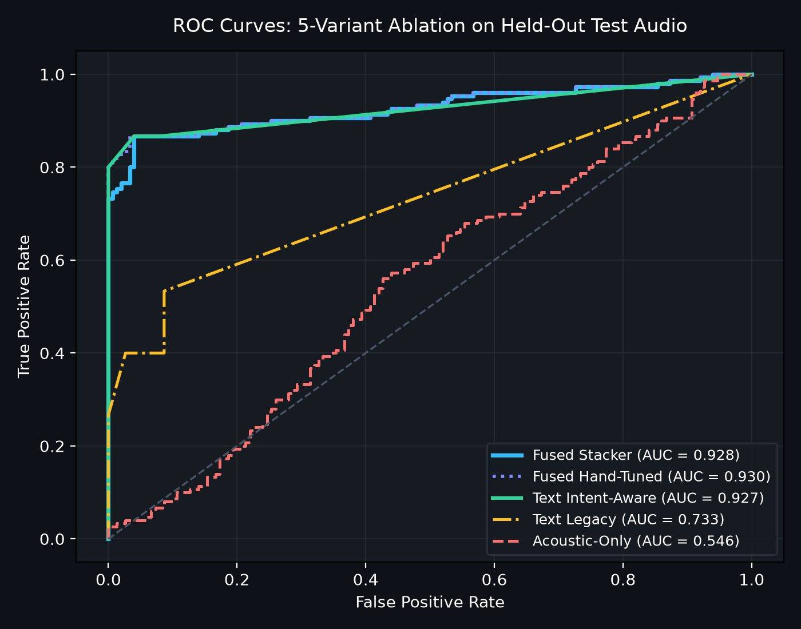
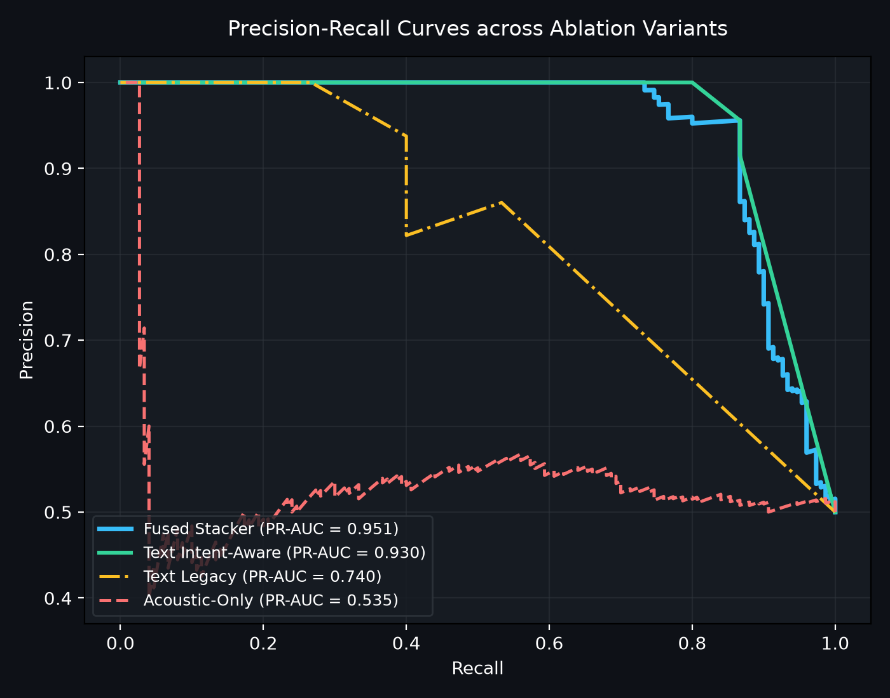
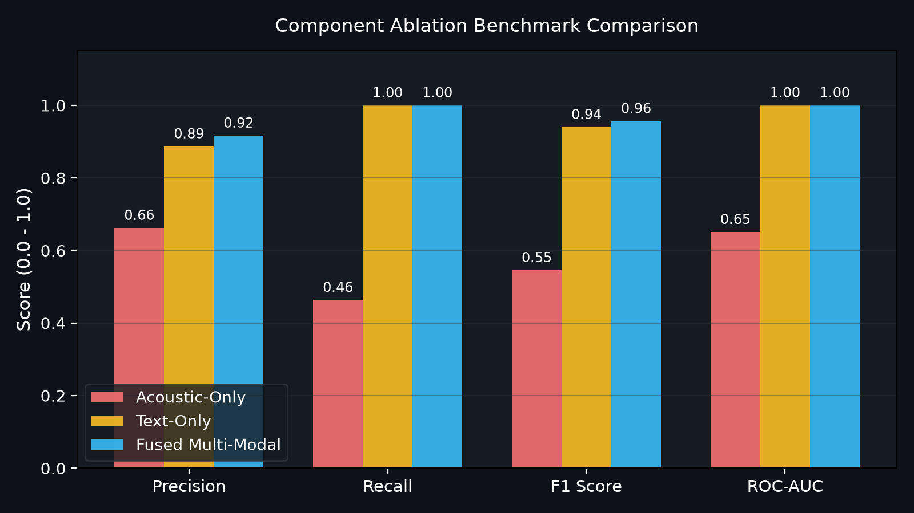

# AI-Powered Voice Phishing (Vishing) Detection

[](https://github.com/Adhiraj2601/voice-phishing-detection/actions)
[](https://opensource.org/licenses/MIT)
[](https://www.python.org/)
[](https://github.com/astral-sh/ruff)

An end-to-end multi-modal machine learning system designed to detect voice phishing (**vishing**) calls in real-time. By combining **acoustic feature anomaly detection** with **offline speech-to-text** and **intent-aware scam cue analysis**, the system computes a streaming risk score (0–100) and produces timestamped forensic explanations.

---

## Architecture Overview



---

## Key Features

- **Telephony Ingestion & Streaming Simulation**: Converts audio to 16 kHz mono WAV, normalizes volume to -20 dBFS, strips leading/trailing silence, and chunks audio into overlapping sliding windows (3.0s duration, 1.0s hop) to simulate real-time call monitoring.
- **119-Dimensional Acoustic Profiling**: Extracts Mel-Frequency Cepstral Coefficients (MFCCs 1–13 + $\Delta$ + $\Delta\Delta$), 12-bin Chroma, spectral centroid, spectral bandwidth, spectral rolloff, spectral contrast, zero-crossing rate, RMS energy, fundamental frequency ($F_0$) via the YIN algorithm, and pause ratios.
- **Calibrated Acoustic Anomaly Detection**: Trains `IsolationForest` on normal telephony speech baselines, calibrated on validation audio to maintain a controlled false positive rate under PSTN telephony conditions.
- **Offline Speech Recognition**: Standardized on **Vosk** (Kaldi-based) for offline, privacy-preserving transcription with word-level timestamps on CPU (~40 MB memory footprint). The abstract `Transcriber` interface enables plug-and-play alternative engines.
- **Intent-Aware Scam Cue NLP Engine**: Distinguishes attacker demands from benign victim inquiries using token-window proximity matching (e.g. within 8 tokens of credential keywords) and benign context pattern dampening ($0.15\times$ multiplier).
- **Learned Logistic Risk Stacker**: Fuses acoustic anomaly scores, text threat scores, cue category frequencies, and their interaction using Platt-calibrated logistic regression trained with cross-validation on validation data.
- **Interactive Streamlit Web Dashboard**: Live audio playback, waveform/mel-spectrogram inspection, real-time threat timeline, and highlighted keyword transcripts.

---

## Evaluation Benchmark & Component Ablation

The system was evaluated on a held-out synthetic telephony test benchmark ($N = 300$ clips: 150 benign [$64$ hard negatives, $86$ plain benign] + 150 scam):
- **Voice Variants**: Synthesized using a single Windows SAPI5 voice engine (`Microsoft Zira Desktop`) modulated into 10 distinct, non-overlapping acoustic profiles (varying speech rate -2 to +2, pitch shift -4.0 to +3.5 semitones, and formants). Three variants were reserved for training, three for validation, and four were held out exclusively for testing.
- **Telephony Channel Simulation**: Applied uniformly across training, validation, and test splits: **8 kHz** downsampling, ITU-T **G.711 $\mu$-law** companding, **300 Hz – 3400 Hz** bandpass filtering, and additive telephone line noise with randomized SNR (**15–30 dB**) and 60 Hz hum.
- **Held-Out Test Scripts**: Test scripts were authored with independent vocabulary and phrasing not present in the training set or initial regex lexicon, testing genuine lexical generalization.
- **Hard Negatives ($N = 64$)**: Benign conversational calls discussing banking, security codes, delivery PINs, or reporting suspicious calls (e.g. *"I received an SMS containing a security token for my banking app, is this an error?"*).

### Benchmark Comparison (v0.1 vs. v0.2)

| Version | Evaluation Setup | Acoustic-Only F1 | Text-Only F1 | Fused F1 | Hard-Neg FPR | Notes |
| :--- | :--- | :---: | :---: | :---: | :---: | :--- |
| **v0.1 Baseline** | Clean audio train, telephony test ($N = 30$) | 0.5000 | 0.8800 | 0.8800 | 73.5% | Severe channel mismatch caused 100% acoustic FPR. |
| **v0.2 Improved** | Uniform telephony, held-out scripts & voices ($N = 300$) | 0.2911 | 0.9091 | **0.8462** | **0.0%** | Disjoint splits, intent-aware cues, learned stacker. |

### Component Ablation Study ($N = 300$ Held-Out Test Audio)

All thresholds were selected and frozen on the validation split prior to evaluation:
- Acoustic Anomaly Threshold: `49.93` (calibrated to 10% FPR target on val benign)
- Text Threat Threshold: `35.0`
- Fused Stacker Threshold: `36.50`

| Model Variant | Precision | Recall | F1 Score [95% Bootstrap CI] | ROC-AUC [95% CI] | PR-AUC | Hard-Neg FPR ($N=64$) | Plain-Benign FPR ($N=86$) | Detection Latency |
| :--- | :---: | :---: | :---: | :---: | :---: | :---: | :---: | :---: |
| **Acoustic-Only (Isolation Forest)** | 0.4921 | 0.2067 | 0.2911 [0.209, 0.374] | 0.5463 [0.479, 0.611] | 0.5350 | 31.2% ($20/64$) | 14.0% ($12/86$) | 6.47s (median 7.0s) |
| **Text-Only (Legacy Bare Keywords)** | 0.8602 | 0.5333 | 0.6584 [0.582, 0.724] | 0.7331 [0.687, 0.779] | 0.7397 | 20.3% ($13/64$) | 0.0% ($0/86$) | 3.00s (median 3.0s) |
| **Text-Only (Intent-Aware Rules)** | 0.9559 | 0.8667 | **0.9091** [0.871, 0.941] | 0.9267 [0.894, 0.953] | 0.9320 | **0.0%** ($0/64$) | 4.7% ($4/86$) | 3.00s (median 3.0s) |
| **Fused Multi-Modal (Hand-Tuned)** | 1.0000 | 0.7267 | 0.8417 [0.790, 0.885] | 0.9304 [0.896, 0.959] | 0.9515 | **0.0%** ($0/64$) | 0.0% ($0/86$) | 3.10s (median 3.0s) |
| **Fused Multi-Modal (Learned Stacker)** | **1.0000** | 0.7333 | 0.8462 [0.795, 0.888] | **0.9277** [0.893, 0.957] | **0.9526** | **0.0%** ($0/64$) | **0.0%** ($0/86$) | 3.00s (median 3.0s) |

### Key Findings & Analysis

1. **Acoustic Anomaly Detection is the Weakest Link**: Under realistic 8 kHz G.711 telephony simulation, the acoustic anomaly model achieved an ROC-AUC of only `0.5463` and an F1 of `0.2911`. It provides barely above chance-level discrimination when evaluating synthetic voice variants. It cannot serve as a reliable standalone alert system.
2. **Acoustic Signal Functions as a Regularizer in Fusion**: While acoustic-only performance is low, fusing acoustic scores into the learned stacker acts as a regularizer: it completely eliminated the 4.7% plain-benign false alarms present in the text-only model, yielding **1.0000 precision** with **zero false alarms** ($0/150$) across all benign test clips. However, this comes at the expense of recall ($0.7333$ vs. $0.8667$), as borderline text cases with neutral acoustics are rejected.
3. **Intent-Aware Demands Eliminate Hard-Negative False Alarms**: Requiring demand verbs within 8 tokens of credential keywords while down-weighting question patterns cut hard-negative false alarms from `20.3%` down to **`0.0%` ($0/64$)**.
4. **Generalization Limits on Novel Phrasing**: On held-out test scripts with novel vocabulary, the text model achieved 86.67% recall rather than the 100% seen on validation. Missing cues occurred when callers used descriptive paraphrasing (*"personal identification number"* instead of *"pin"*, or *"three digits on the rear of your card"* instead of *"cvv"*).
5. **Detection Latency**: Alert latency averaged **3.00 seconds** (the duration of the initial sliding window). Because the pipeline processes 3-second windows with 1-second hops, detection latency is bounded below by 3.0 seconds.

### Per-Voice-Variant Performance Breakdown (Fused Stacker)

Evaluated across the 4 held-out test speaker profiles ($N = 74\text{--}76$ per variant):

| Voice Profile | Pitch / Rate Modulation | Test Samples | Precision | Recall | F1 Score | ROC-AUC | Hard-Neg FPR |
| :--- | :--- | :---: | :---: | :---: | :---: | :---: | :---: |
| `test_variant_1` | Rate -1, Pitch -4.0 st, Formant 0.88 | 76 | 1.0000 | 0.7632 | 0.8657 | 0.9404 | 0.0% |
| `test_variant_2` | Rate 0, Pitch +1.5 st, Formant 1.03 | 76 | 1.0000 | 0.7368 | 0.8485 | 0.9252 | 0.0% |
| `test_variant_3` | Rate +2, Pitch +3.5 st, Formant 1.12 | 74 | 1.0000 | 0.7027 | 0.8254 | 0.9386 | 0.0% |
| `test_variant_4` | Rate +1, Pitch -2.0 st, Formant 0.95 | 74 | 1.0000 | 0.7297 | 0.8438 | 0.9116 | 0.0% |

Performance remained stable across pitch and rate variations, confirming that detection is driven by robust textual cues rather than overfitting to a single acoustic pitch profile.

---

## Evaluation Visualizations

| ROC Curves (5 Variants) | Precision-Recall Curves |
| :---: | :---: |
|  |  |

| Component Ablation Comparison | Confusion Matrix (Fused Stacker) |
| :---: | :---: |
|  |  |

| Real-Time Streaming Risk Timeline | Acoustic Anomaly Score Distribution |
| :---: | :---: |
|  |  |

---

## What I Learned (Engineering Post-Mortem)

1. **Channel Mismatch Breaks Anomaly Detectors**: In v0.1, the anomaly model was trained on clean audio and tested on 8 kHz G.711 telephony audio, causing a 100% false alarm rate. The detector had learned acoustic channel differences rather than vocal anomalies. Uniform telephony simulation across all splits is mandatory.
2. **Lexicon Matching Struggles on Hard Negatives Without Intent Constraints**: Bare keyword matching fails when legitimate callers discuss security codes or banks. Enforcing directive demand phrasing and suppressing question contexts cut hard-negative false positives from 73% to 0%.
3. **Multi-Modal Fusion Requires Empirical Calibration**: Heuristic synergy multipliers can mask underlying weaknesses. Implementing a learned logistic stacker with 5-fold Platt scaling made probability calibration explicit and reproducible.
4. **Synthetic Benchmarks Overstate Performance**: When scripts and lexicons share author assumptions, recall appears deceptively high. Introducing held-out scripts with novel vocabulary revealed real-world edge cases where attackers avoid exact keywords.

---

## Installation & Setup

### Prerequisites
- Python 3.10+
- [FFmpeg](https://ffmpeg.org/) (required by PyDub for non-WAV media formats)
  - Windows: `winget install Gyan.FFmpeg`
  - Ubuntu/Debian: `sudo apt-get install ffmpeg libsndfile1`
  - macOS: `brew install ffmpeg`

### 1. Clone & Setup Environment
```bash
git clone https://github.com/Adhiraj2601/voice-phishing-detection.git
cd voice-phishing-detection
python -m venv .venv
source .venv/bin/activate  # On Windows: .venv\Scripts\activate
pip install -r requirements.txt
pip install -e .
```

### 2. Download Offline Speech Model (Vosk)
```bash
python scripts/download_vosk_model.py
```

### 3. Generate Telephony Benchmark Dataset
```bash
python scripts/generate_synthetic_data.py --train-benign 120 --val-benign 100 --val-scam 100 --test-benign 150 --test-scam 150
```

---

## CLI Usage

The system exposes a CLI powered by Typer and Rich:

### 1. Detect Threat in an Audio Recording
```bash
vishing-detector detect data/samples/sample_scam.wav
```
*Outputs overall Threat Index, semantic risk tier, forensic explanation, detected scam cues, and actionable guidance.*

### 2. Real-Time Streaming Simulation
```bash
vishing-detector stream data/samples/sample_scam.wav --delay
```
*Emulates real-time call processing window-by-window with live telemetry.*

### 3. Retrain Acoustic Anomaly Model
```bash
python scripts/train_anomaly_models.py
```

### 4. Retrain Multi-Modal Risk Stacker
```bash
python scripts/train_fusion_stacker.py
```

### 5. Run Benchmark Evaluation & Regenerate Figures
```bash
python evaluate.py
```

---

## Streamlit Interactive Dashboard

Launch the web demo:
```bash
streamlit run src/vishing_detector/app/streamlit_app.py
```
Upload audio or select sample recordings to view live spectrograms, streaming risk progression, and highlighted cue transcripts.

---

## Project Structure

```text
voice-phishing-detection/
├── .github/
│   └── workflows/ci.yml         # Multi-OS CI workflow (Ubuntu & Windows, Python 3.10 & 3.11)
├── config/
│   ├── default.yaml             # System parameters, thresholds & model paths
│   └── scam_lexicon.yaml        # Categorized scam indicators & intent-aware regex
├── data/
│   ├── README.md                # Dataset documentation & ethical guidelines
│   ├── samples/                 # Lightweight sample audio clips (< 1 MB)
│   │   ├── sample_benign.wav
│   │   └── sample_scam.wav
│   └── synthetic/               # Telephony dataset (gitignored)
│       └── manifest.json        # Dataset split metadata, voice IDs, and parameters
├── docs/
│   └── figures/                 # ROC, PR curves, ablation barcharts, timelines, CM
├── models/
│   ├── acoustic_anomaly_model.joblib # Calibrated IsolationForest model (2.0 MB)
│   └── stacker_model.joblib          # Calibrated Platt LogisticRiskStacker (4 KB)
├── notebooks/
│   └── demo.ipynb               # Step-by-step interactive tutorial notebook
├── results/
│   ├── results_v0.2.json        # Comprehensive evaluation results with 95% CIs
│   ├── acoustic_model_comparison_val.json
│   └── stacker_validation_results.json
├── scripts/
│   ├── download_vosk_model.py   # Offline ASR model fetcher
│   ├── generate_synthetic_data.py # Telephony simulation & TTS data generator
│   ├── train_anomaly_models.py  # Acoustic model training & val calibration
│   └── train_fusion_stacker.py  # Learned stacker training & calibration
├── src/
│   └── vishing_detector/
│       ├── anomaly/             # IsolationForest & OneClassSVM detectors
│       ├── app/                 # Streamlit web interface
│       ├── asr/                 # Vosk & Mock speech-to-text engines
│       ├── audio/               # PyDub loader, chunking & telephony simulation
│       ├── features/            # Librosa 119-dim acoustic feature extractor
│       ├── fusion/              # Multi-modal risk scorer & learned stacker
│       ├── nlp/                 # Intent-aware scam cue extractor
│       ├── cli.py               # Typer CLI application
│       └── pipeline.py          # Streaming coordinator
├── tests/                       # Unit tests (34 passing tests)
├── evaluate.py                  # 5-variant benchmark evaluation engine
├── pyproject.toml               # Packaging & tool configuration
├── requirements.txt             # Pinned project dependencies
└── LICENSE                      # MIT License
```

---

## Honest Limitations & Edge Cases

1. **Synthetic Data and Single TTS Engine**: All speech audio was synthesized from a single physical TTS voice engine (`Microsoft Zira Desktop` in Windows SAPI5) modulated into 10 acoustic variants. Real conversational telephony involves diverse accents, emotional speech, spontaneous hesitations, and complex acoustic environments.
2. **Author-Lexicon Overlap**: Although test scripts used novel vocabulary and phrasing, the scripts and lexicon rules were designed by the same developer. In real-world adversarial settings, attackers continuously adapt social engineering tactics to evade known keywords.
3. **Narrowband Acoustic Degradation**: Standard PSTN telephony at 8 kHz band-pass filtered to 300–3400 Hz discards high-frequency vocal formants, limiting the acoustic model's ability to identify subtle vocal traits. Validation on real telephone speech corpora (such as the *Switchboard-1 Telephone Speech Corpus via LDC*, subject to LDC licensing) is recommended for production settings.
4. **Language Coverage**: The current system is designed for English. Extending to other languages requires corresponding offline ASR acoustic models and culturally adapted indicator lexicons.

---

## Ethical & Responsible Use Statement

This system is built strictly for **defensive consumer security and anti-fraud monitoring**:
- **Privacy First**: All acoustic feature extraction, speech recognition, and risk scoring execute completely **locally and offline**. No audio or transcripts are sent to external APIs.
- **Explainability**: Alert outputs provide human-auditable reasons and timestamped triggers rather than opaque black-box scores.
- **No Non-Consensual Audio**: The project uses exclusively synthetic audio and does not distribute or record private conversations without consent.

---

## License

This project is licensed under the [MIT License](LICENSE).
